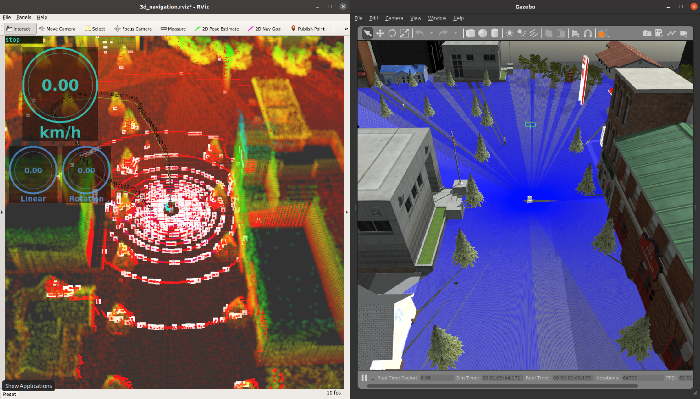

# kcctcore
Kobe Kosen RoboticsのNavigationパッケージをつなぐマスターパッケージ

3D Simulation


rqt_graph


---

## Dependency

* 必要パッケージは[rosenv](https://github.com/hrjp/rosenv/blob/main/package_install.bash)
* docker imageを利用する場合[naviton](https://github.com/KobeKosenRobotics/naviton)

```bash
git clone https://github.com/hrjp/rosenv
./rosenv/package_install.bash
./rosenv/gazebo_update.bash
./rosenv/naviton_package.bash
```

---

## navigation.launch
自律移動を行うためのlaunch

```
roslaunch kcctcore navigation.launch
```

#### 操作方法
rvizの左下に表示されるnavigation panelで操作
* start : navigation start
* pause : navigation pause
* initialpose : 現在のwaypointに自己位置を合わせる
##### 3D Pose Estimate (３D初期位置合わせ)
1. rviz上部の2d nav goalでxy座標を決定、
2. navigation panel内の3D POSE ESTIMATEの左側の数値でz軸を決定
3. navigation panel内の3D POSE ESTIMATEの右側のpublishボタンをクリック


### parameter
* sim : gazevo simulationを使用する
* map_2d : 2D でNavigationする
* waypoint_file : 使用するwaypointファイルの場所
* world_name : gazeboのworldファイルの場所
* map_pcd : 3D Navigationで使用するpcdファイルの場所
* map_2d_file : 2D Navigationで使用するmapのyamlファイルの場所

---

## waypoint.launch
waypointのマーキングを行うlaunch
終了時にkcctcore/config/waypointdata/waypoint.csvに自動保存される


```
roslaunch kcctcore waypoint.launch
```

#### 操作方法
rvizの左下に表示されるnavigation panelで操作
* start : waypoint marking start
* pause : waypoint marking pause
* initialpose : 現在のwaypointに自己位置を合わせる
##### 3D Pose Estimate (３D初期位置合わせ)
1. rviz上部の2d nav goalでxy座標を決定、
2. navigation panel内の3D POSE ESTIMATEの左側の数値でz軸を決定
3. navigation panel内の3D POSE ESTIMATEの右側のpublishボタンをクリック


### parameter
* sim : gazevo simulationを使用する
* map_2d : 2D で自己位置推定をする
* world_name : gazeboのworldファイルの場所
* map_pcd : 3D 自己位置推定で使用するpcdファイルの場所
* map_2d_file : 2D 自己位置推定で使用するmapのyamlファイルの場所

---

## mapping.launch (simlation環境の2Dmappingは未対応)
rosbagから地図を作成するlaunch
```
roslaunch kcctcore mapping.launch
```
3D Mapは終了時にLeGO-LOAM/LeGO-LOAM/pcdに自動保存される

2D Mapは以下のコマンドで保存
```
rosrun map_server map_saver -f MAP_NAME
```


### parameter
* map_2d : 2D mappingをする
* bag_file : rosbag ファイルの場所
* playback_speed : rosbagの再生速度

---

## Kobe Kosen Robotics Navigation Packages
* [naviton](https://github.com/KobeKosenRobotics/naviton)
    * kobe kosen roboticsの自律移動ロボットnavitonの環境構築
* [kcctcore](https://github.com/hrjp/kcctcore)
    * 各パッケージをつなぐマスターパッケージ
* [kcctnavigation](https://github.com/hrjp/kcctnavigation)
    * 自律移動用アルゴリズム全般
* [waypoint_tools](https://github.com/hrjp/waypoint_tools)
    * waypointの読み書きなどwaypointに関連するノード全般
* [kcctsim](https://github.com/hrjp/kcctsim)
    * gazebo simulationとrobotのURDFモデル
* [kcctplugin](https://github.com/hrjp/kcctplugin)
    * 自律移動用のrviz plugin
* [kcctfirm](https://github.com/hrjp/kcctfirm)
    * 自律移動ロボットNavitonのファームウェア
* [LeGO-LOAM](https://github.com/hrjp/LeGO-LOAM)
    * 3D Mapping
    * forked from [LeGO-LOAM](https://github.com/RobustFieldAutonomyLab/LeGO-LOAM)
